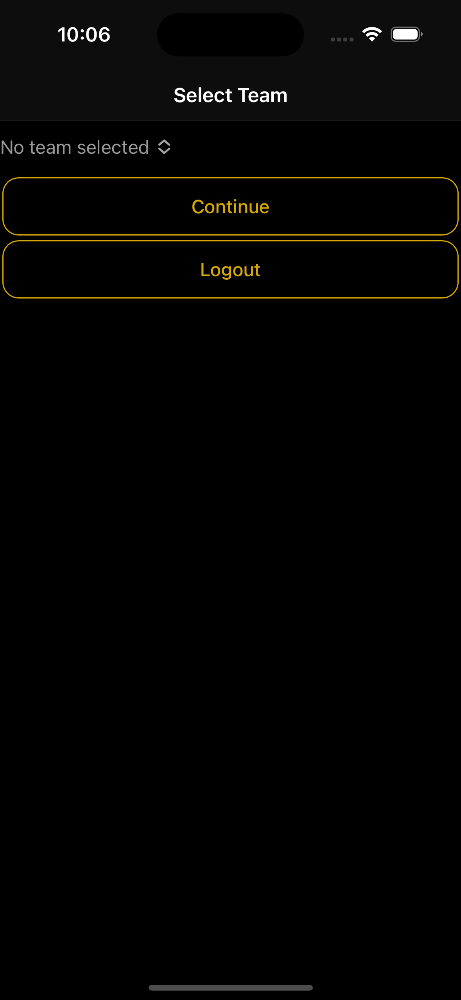
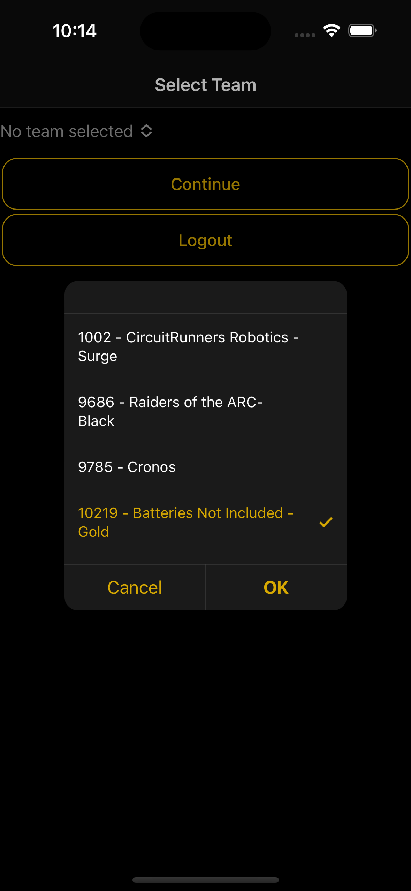
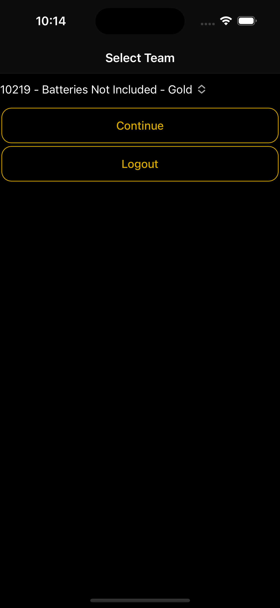

# Selecting a Team to Scout

Alternatively, if you'd like to logout, click the Logout button.

<figure><figcaption></figcaption></figure>

<figure><figcaption></figcaption></figure>

<figure><figcaption></figcaption></figure>
