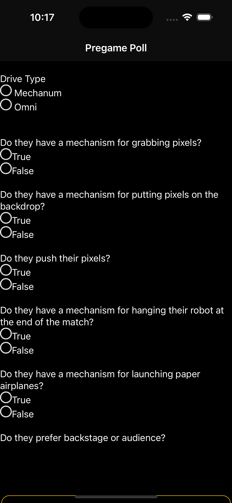
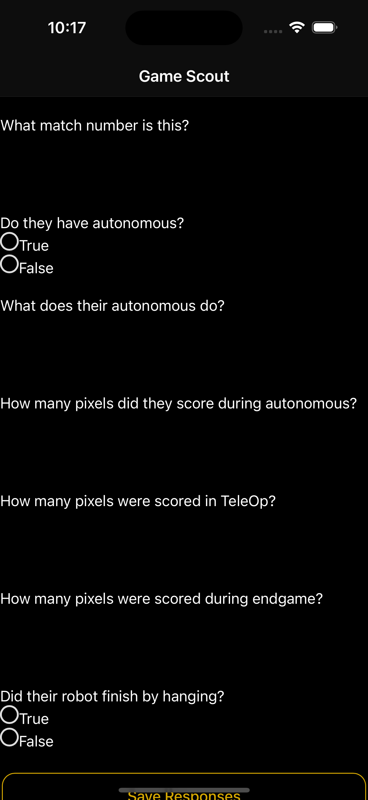

# Form Pages

There are two form pages - Pregame Poll and Game Scout. Each page allows you to fill out a form using questions selected by your coach. However, Pregame Poll can only be completed once per team (when [Automatic Data Management](automatic-data-management.md) is turned on), while Game Scout can be completed multiple times per team.&#x20;

<figure><figcaption></figcaption></figure>

<figure><figcaption></figcaption></figure>
