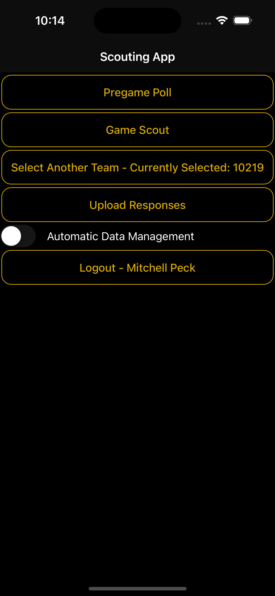
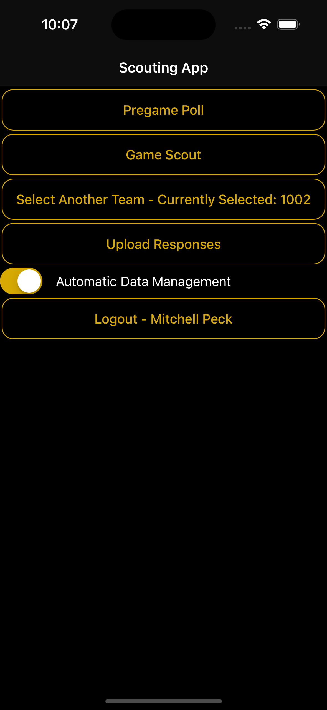

# Home Screen

The home screen allows you to access the rest of the functionality of the app. From top down, the buttons are:

* Pregame Poll
* Game Scout
* Select Another Team
* Upload Responses
* Logout

There is also a toggle labeled 'Automatic Data Management'. For more information, see [here](automatic-data-management.md).

Clicking Pregame Poll or Game Scout will take you to the respective [Form page](form-pages.md).

Clicking Select Another Team will take you back to the [Select Team page](../accessing/selecting-a-team-to-scout.md). Click this when you want to select another team to scout, whether for Pregame Poll or Game Scout.

Clicking Upload Responses will [upload your responses](uploading-your-responses.md). This is only necessary when [Automatic Data Management](automatic-data-management.md) is turned off.

Clicking Logout will take you back to the [Login page](../accessing/login.md).

<figure><figcaption></figcaption></figure>

<figure><figcaption></figcaption></figure>
